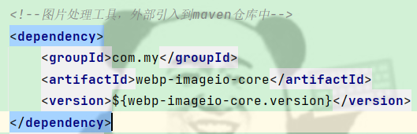

# blog-backEnd

### 项目概述

基于Spring Boot、Spring Security、Redis等的后台Java项目。

* [前端地址](https://github.com/shuaigang0124/blog-frontEnd)
* [后台地址](https://github.com/shuaigang0124/blog-backEnd)
* [项目预览](https://shuaigang.top)

#### 注意事项

* maven依赖webp需要自己手动下载引入仓库
* 

#### 相关环境需求

* Java11、redis、mysql

#### 联系作者

* QQ：149190793

#### 如果觉得项目对你有帮助，请作者喝杯咖啡吧！

* 
